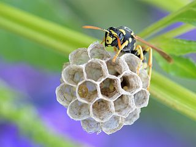
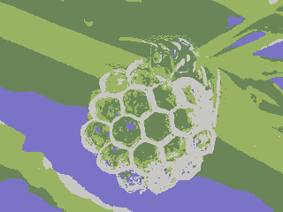
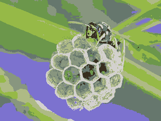
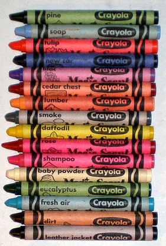
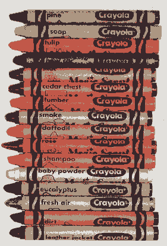
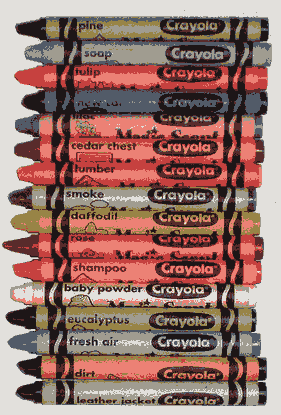

# posterization-pyladies

This is the code for a workshop ([slides](https://docs.google.com/presentation/d/1nSCbIfF0lwROhqM3yh-rzrZ8j6gOO2-D2-jWX3HdSG4/edit?usp=sharing)) I ran for the Seattle Pyladies group in May 2015.  In it we implement [k-means clustering](http://en.wikipedia.org/wiki/K-means_clustering) and use it to "posterize" images.

It requires [matplotlib](http://matplotlib.org/).  Apparently, for some people it also requires [Pillow](https://python-pillow.github.io/) if you want it to work with jpg files, I haven't quite figured out under which circumstances that is.  :O

The file [posterization.py](posterization.py) contains stubs for all the methods.  The "hints" folder contains hints for writing each one, while the "solution" folder contains my solution (which, it goes without saying, is not the only one).

For instance, if you start with the bee image (from http://commons.wikimedia.org/wiki/File:Polistes_May_2013-2.jpg)

and posterize it to four colors, you get:

If instead you use eight colors, you get:

Similarly, if you start with the crayon image (from http://commons.wikimedia.org/wiki/File:Crayons-scent.png)

and posterize it to four colors, you get:

If instead you use eight colors, you get

